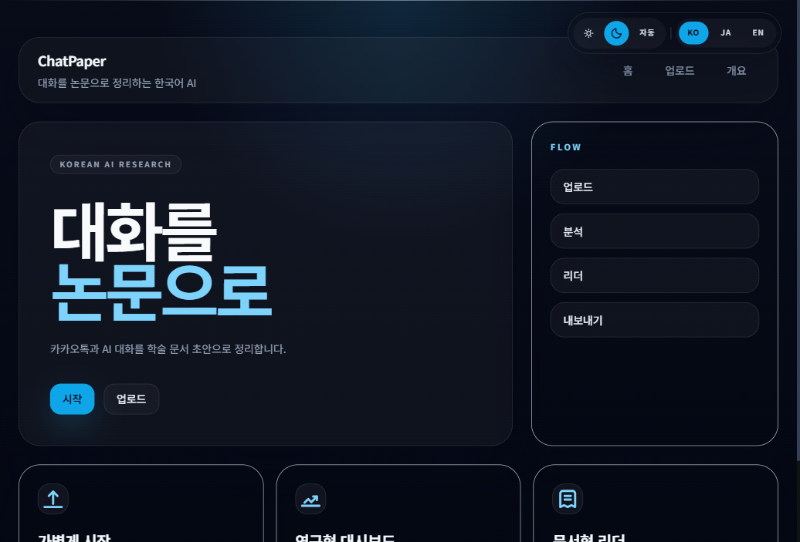
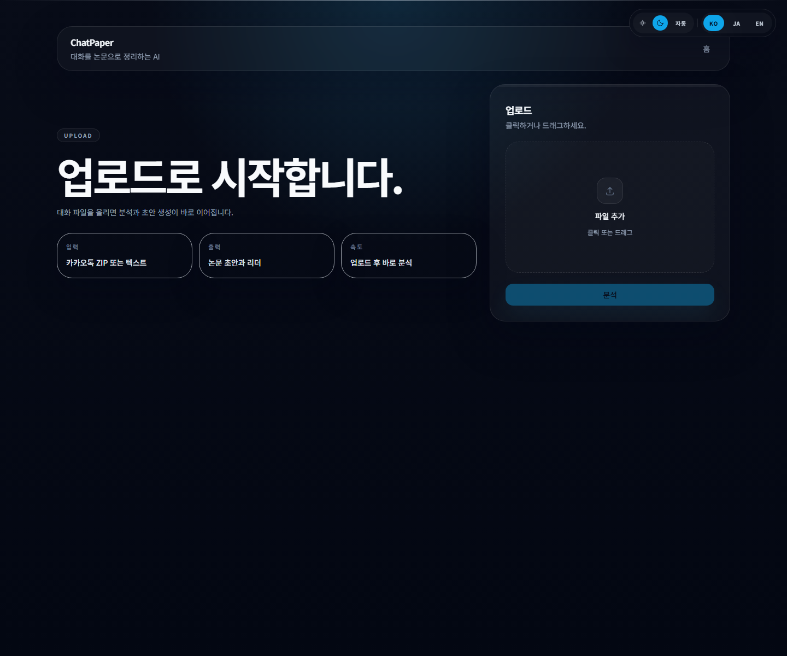
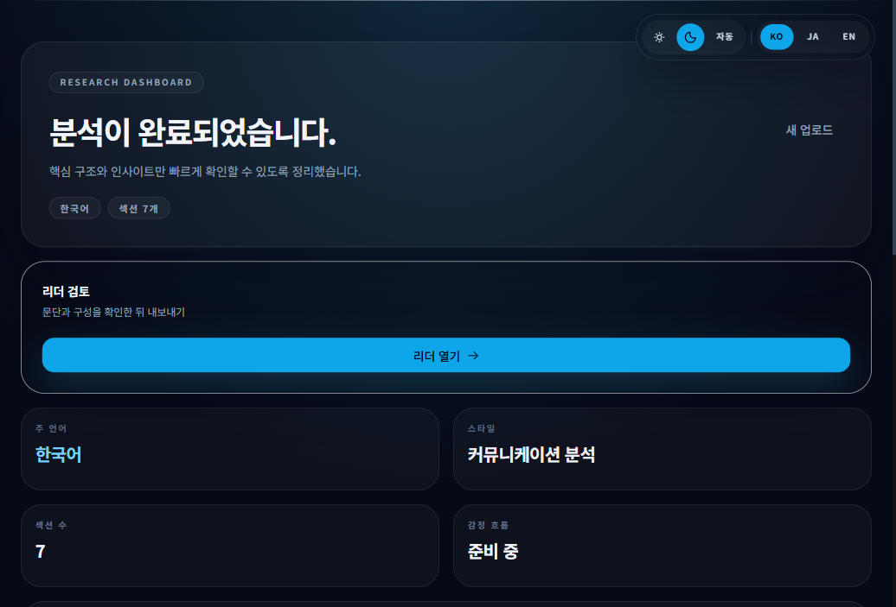
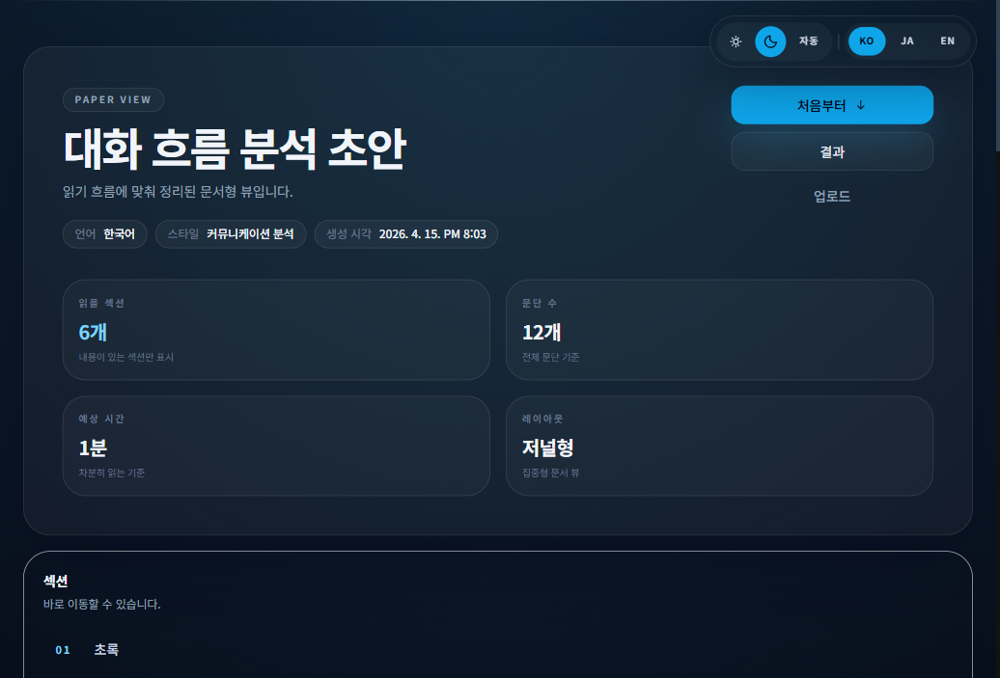
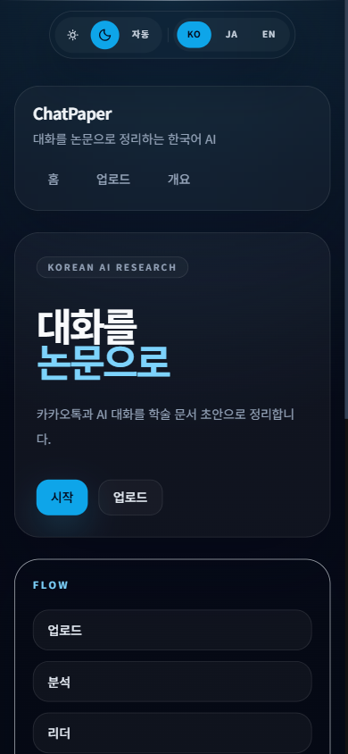
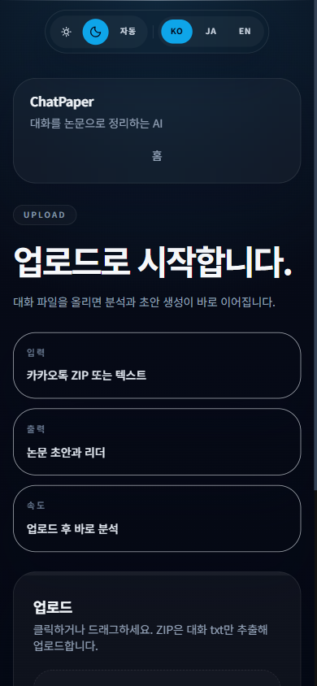
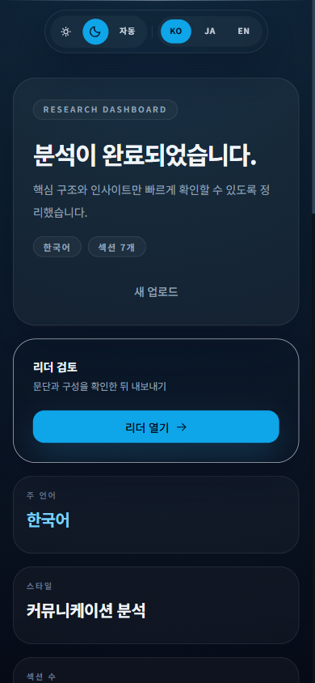
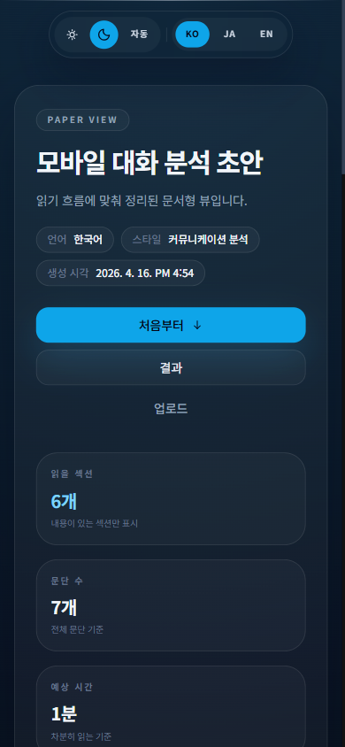

# Chat Paper

[English](README.md) | [한국어](README.ko.md) | [日本語](README.ja.md) | [Technical Whitepaper (EN)](docs/chat-paper-ai-technical-whitepaper-en.md) | [기술 백서 (KO)](docs/chat-paper-ai-technical-whitepaper-ko.md)

**An async AI pipeline that transforms KakaoTalk, Instagram DM, LINE, and AI conversation logs into peer-reviewed-style academic papers — without an account.**



---

## Overview

Chat Paper solves a specific problem: conversational data contains meaningful analytical signal — topic progression, emotional arcs, speaker dynamics, communication patterns — but no tooling exists to surface it in a structured, citable format.

The platform accepts raw conversation exports, parses and anonymizes them on the server, queues a long-running AI generation job, and produces a full academic paper with title, abstract, introduction, methods, results, discussion, and conclusion. Seven writing styles are supported: psychology paper, communication analysis, relationship dynamics, sociology, behavioral science, computational text analysis, and bioinformatics.

The entire flow is guest-first. No account is required. A browser-scoped session cookie ties uploads to results.

---

## Screenshots

### Landing


### Upload flow



### Research dashboard



### Paper reader



### Mobile preview

| Landing | Upload |
| --- | --- |
|  |  |
| Dashboard | Reader |
|  |  |

---

## Architecture

The system is built around an asynchronous pipeline. Paper generation takes 2–8 minutes depending on conversation length, so synchronous HTTP would time out. The queue decouples ingestion from processing and provides retry, idempotency, and recovery for free.

```
Client
  │
  │  HTTPS
  ▼
Next.js API Layer  ─────────────────────────────────────────────────
  │  /api/upload          /api/analyze         /api/jobs/[id]
  │
  ├── Tier 1: IP preflight rate limit (Redis, before any DB)
  ├── Tier 2: Route rate limit (Redis, IP + cookie guest key)
  ├── Tier 3: Daily quota check (PostgreSQL, after rate limits pass)
  │
  ├── Upload path:   parse → anonymize → save ParsedMessages → 200 OK
  │
  └── Analyze path:  SHA-256 idempotency key
                     Serializable transaction: quota + Paper + Job
                     queue.add(jobId = idempotencyKey)
                     │
  ┌──────────────────┘
  │
  ▼
Redis (BullMQ Queue)
  paper-generation queue
  rate-limit counters
  preflight:ip:* keys
  │
  │  Worker.process()
  ▼
Node.js Worker Process (Fly.io)
  processPaperJob(data, abortSignal)
  │
  ├── markJobProcessing (PENDING → PROCESSING)
  ├── Load ParsedMessages from DB
  ├── chunkMessages() → max 3 chunks
  ├── Promise.all: analyseRelationship + summariseChunk × N
  ├── generatePaperSection × 7 (two parallel batches)
  └── prisma.$transaction: Paper + Job → COMPLETED (atomic)
  │
  ▼
PostgreSQL (Prisma)
  User / Upload / ParsedMessage / Paper / Job / JobLog / Export
```

**Why BullMQ:** Paper generation involves multiple sequential and parallel OpenAI calls with retry logic. BullMQ provides durable job storage in Redis, configurable retry with exponential backoff, job-level idempotency via `jobId`, progress tracking, and a recovery mechanism for stuck jobs — all without writing a custom queue.

---

## Tech Stack

| Layer | Technology | Purpose |
|---|---|---|
| **API** | Next.js 14 App Router | HTTP endpoints, middleware, SSR |
| **Language** | TypeScript (strict) | End-to-end type safety |
| **Styling** | Tailwind CSS + shadcn/ui | Component system |
| **Queue** | BullMQ v5 | Async job queue, retry, idempotency |
| **Queue broker** | Redis (ioredis) | BullMQ broker + rate-limit counters |
| **Worker** | Node.js standalone | Long-running AI pipeline execution |
| **ORM** | Prisma | Type-safe PostgreSQL access |
| **Database** | PostgreSQL | State persistence, transactions |
| **AI** | OpenAI GPT-4o-mini | Conversation analysis + paper generation |
| **Logging** | pino | Structured JSON logs |
| **Deployment** | Fly.io (worker) + Vercel (API) | Independent scaling |

---

## Core Backend Design

### API Layer

**Upload validation (7-step gate, in order):**

```
1. checkIpPreflightRateLimit    Redis INCR, IP-only, 30 req/60s — before any DB
2. checkRouteRateLimit          Redis INCR, IP (8/min) + guest cookie (6/min)
3. validateContentLength        Header check: missing → reject, > 51 MB → reject
4. getGuestUser()               First DB access: prisma.user.upsert
5. checkUploadQuota             DB count: max 20 uploads/day per user
6. req.formData()               Body streaming begins only here
7. parse → anonymize → save
```

The ordering of steps 1–3 before step 4 is the primary DB DoS defense. An attacker cannot trigger `prisma.user.upsert` (a write) without first clearing two independent Redis rate checks.

**ZIP bomb mitigation:**

```
Max entries:              500
Max per-entry size:       50 MB
Max total uncompressed:   100 MB (cumulative sum across all entries)
Metadata integrity:       JSZip _data.uncompressedSize validated as
                          a non-negative safe integer before decompression
```

**Format auto-detection:** `.html/.htm` → Instagram DM; `.json` with `timestamp_ms` + `sender_name` → Instagram DM; tab-delimited timestamps → LINE; `*Human/*Assistant` → AI conversation; Korean date pattern → KakaoTalk.

---

### Queue Layer

**BullMQ configuration:**

```javascript
PAPER_JOB_OPTIONS = {
  attempts:         3,
  backoff:          { type: 'exponential', delay: 5_000 },  // 5s → 10s → 20s
  removeOnComplete: { count: 100 },
  removeOnFail:     { count: 500 },
  jobId:            idempotencyKey,   // SHA-256(uploadId:style:lang)
}

Worker options:
  lockDuration:  jobTimeoutMs + 90_000   // lock outlasts the hard deadline
  lockRenewTime: min(2min, jobTimeoutMs / 3)
  limiter:       { max: 2, duration: 10_000 }
```

**Idempotency:** The SHA-256 hash of `(uploadId, writingStyle, lang)` serves as the BullMQ `jobId` and as the PostgreSQL `idempotencyKey` unique constraint. Concurrent duplicate requests hit `P2002` on the DB unique constraint and return the existing job rather than creating a second one.

**Serializable transaction for analyze:**

```
BEGIN ISOLATION LEVEL SERIALIZABLE
  assert concurrent jobs < 2
  assert daily jobs < 10
  INSERT INTO papers (status = PROCESSING)
  INSERT INTO jobs   (idempotencyKey, status = PENDING)
COMMIT
→ P2034 (serialization failure) → 409
→ P2002 (idempotency key exists) → return existing job
```

---

### Worker Layer

**Job lifecycle:**

```
BullMQ dequeues job
  → runWithHardDeadline(data, jobTimeoutMs)
      AbortController created
      setTimeout(abort, jobTimeoutMs)
      Promise.race([processPaperJob(...), timeout])
  → markJobProcessing: PENDING → PROCESSING (atomic, guard count == 1)
  → Load ParsedMessages (DB)
  → chunkMessages() — sliding window, max 3 chunks
  → Promise.all:
      analyseRelationship(signal)      parallel
      summariseChunk × N (serial)      parallel branch
  → generatePaperSection batch 1: title + abstract + introduction  (parallel)
  → generatePaperSection batch 2: methods + results + discussion + conclusion  (parallel)
  → prisma.$transaction:
      UPDATE papers WHERE status = PROCESSING → COMPLETED
      UPDATE jobs   WHERE status = PROCESSING → COMPLETED
      Throw if either count ≠ 1
```

**AbortSignal chain:** Job timeout → `AbortController.abort()` → `signal.aborted` checked between steps → `callWithRetry` checks `parentSignal.aborted` at loop start → per-request controller abort → OpenAI SDK cancels in-flight fetch.

**Chunking algorithm:**

```
Token estimation:  ceil(koreanChars × 1.5 + otherChars × 0.25)
Chunk budget:      9,000 tokens (10,000 − 1,000 system prompt reserve)
Overlap:           64 tokens (context continuity at chunk boundaries)
Max chunks:        3 (cost control — merge smallest adjacent pair when exceeded)
```

**Progress tracking:** `jobs.progress` updated at each stage: 5% → 10% → 30% → 55% → 75% → 95% → 100%.

---

### Database Layer

**Schema overview:**

```
User           guest or authenticated identity
Upload         file metadata, parse status → owns ParsedMessages, Papers, Jobs
ParsedMessage  anonymized messages (speakerId, timestamp, text)
               index: (uploadId, timestamp)
Paper          all 7 sections as @db.Text, relationship analysis fields
               status: PROCESSING → COMPLETED | FAILED
Job            execution control record
               idempotencyKey (unique), status, progress 0-100
               startedAt (12-min recovery anchor)
               enqueuedAt (30-min PENDING recovery anchor)
               attempts / maxAttempts
JobLog         append-only structured logs, purged after 7 days
Export         PDF / DOCX metadata
```

**Transaction consistency:** All multi-entity state transitions use `prisma.$transaction` with status guards on both sides:

```sql
UPDATE papers SET status = 'COMPLETED' WHERE id = ? AND status = 'PROCESSING'
UPDATE jobs   SET status = 'COMPLETED' WHERE id = ? AND status = 'PROCESSING'
-- Throws if either affected count ≠ 1
-- Prevents double-completion when a recovered job re-executes
-- while the original execution is still finishing
```

---

## Processing Flow

End-to-end step-by-step:

```
1.  User uploads file (POST /api/upload)
2.  IP preflight → route rate limit → Content-Length check
3.  Guest user upserted (first DB write)
4.  Daily upload quota checked
5.  File parsed: KakaoTalk / Instagram / LINE / AI conversation
6.  Messages anonymized (PII patterns redacted)
7.  ParsedMessages saved to DB
8.  User calls POST /api/analyze with uploadId + style + lang
9.  IP preflight → route rate limit
10. Guest user loaded
11. SHA-256 idempotency key derived
12. Serializable transaction: quota check + Paper created + Job created
13. Job enqueued in Redis with jobId = idempotencyKey
14. Worker picks up job from BullMQ queue
15. Messages loaded from DB, chunked into ≤ 3 token windows
16. Parallel: relationship analysis + chunk summaries via OpenAI
17. Two parallel batches of paper section generation via OpenAI
18. Atomic transaction: Paper + Job marked COMPLETED
19. Client polls GET /api/jobs/[jobId] → receives paperId on completion
20. Paper rendered in academic reader with export options
```

---

## Reliability & Safety

### Retry and Backoff

```
Max retries:  5
Per-request timeout:  90 seconds (AbortController)

Retryable:    HTTP 429, HTTP 5xx, ECONNRESET, ETIMEDOUT,
              ENOTFOUND, "fetch failed", "network", "socket", AbortError

Backoff:
  429:   parse "try again in Xs" → X × 1000 + 500ms
  other: 1000 × 2^attempt + random(0–1000)ms

Non-retryable: 4xx client errors (thrown immediately)
```

The `sleep()` function is interruptible: if the parent AbortSignal fires during a backoff wait, the sleep resolves immediately with an abort error rather than blocking until the delay expires.

### Stuck Job Recovery (runs every 5 minutes)

**PROCESSING path (12-minute threshold):**

```
For each job where status = PROCESSING AND startedAt < now - 12min:
  if attempts exhausted:
    atomic: Job → FAILED, Paper → FAILED
  else:
    check Redis state of bullJobId
    if RUNNABLE (active/waiting/delayed): skip (still running)
    if TERMINAL (failed/completed): remove + requeue
    DB optimistic guard: updateMany WHERE status = PROCESSING
    if count ≠ 1: remove queued job (race condition rollback)
```

**PENDING path (30-minute threshold):** Re-enqueues jobs where the Redis entry was lost. BullMQ `jobId` deduplication prevents double execution if the entry somehow still exists.

**Log purge:** `jobLog` rows older than 7 days deleted on each recovery sweep.

### Graceful Shutdown

```
SHUTDOWN_TIMEOUT_MS = 4,000ms  (1s margin under Fly.io's 5s SIGKILL)

SIGTERM → handleSignal wrapper (catches rejection)
  → shuttingDown = true (idempotent guard)
  → clearInterval(recoveryTimer)
  → Promise.race([worker.close(), 4s timeout])
  → process.exit(0)
```

---

## Security & Cost Control

### Multi-Tier Rate Limiting

```
Tier 1 — IP preflight (Redis Lua, before any DB access):
  Key:   preflight:ip:{sha256(ip)[0:32]}
  Limit: 30 req / 60 seconds per IP
  Behavior: fail-closed (Redis error → 429)

Tier 2 — Route level (Redis Lua, IP + cookie guest key):
  Upload:  IP 8/min,  guest 6/min
  Analyze: IP 6/min,  guest 4/min
  Note:    guest key read from cookie — no DB required

Tier 3 — Daily quota (PostgreSQL, after guest creation):
  Upload: 20/day
  Jobs:   concurrent ≤ 2, daily ≤ 10 (enforced inside Serializable tx)
```

**Lua atomicity:** INCR and EXPIRE execute in a single Lua script to prevent the race where a crash between the two commands leaves a counter key with no TTL, permanently blocking that key.

### Upload Limits

- File size: 50 MB maximum
- ZIP entries: 500 maximum
- ZIP total uncompressed: 100 MB maximum
- Allowed extensions: `.txt`, `.md`, `.json`, `.html`, `.htm`, `.zip`

### OpenAI Cost Controls

- Model: `gpt-4o-mini` exclusively
- Max tokens per chunk: 9,000
- Max chunks per job: 3 (max ~11 LLM calls per job)
- Daily job quota enforced inside Serializable transaction (concurrent bypass impossible)

---

## Project Structure

```
chat-paper-platform/
│
├── src/
│   ├── app/                    Next.js App Router pages and API routes
│   │   ├── api/
│   │   │   ├── upload/         File ingestion, parsing, anonymization
│   │   │   ├── analyze/        Job creation, idempotency, queue entry
│   │   │   ├── jobs/[jobId]/   Job status polling, ownership check
│   │   │   ├── papers/         Paper retrieval and generation trigger
│   │   │   └── results/        Result aggregation for dashboard
│   │   ├── upload/             Upload page (client)
│   │   ├── result/             Research dashboard (client)
│   │   └── paper/[paperId]/    Academic paper reader (client)
│   │
│   ├── components/             Reusable UI components (shadcn/ui base)
│   ├── lib/
│   │   ├── api/                Response helpers, rate limiting
│   │   ├── auth/               Guest session cookie logic
│   │   ├── db/                 Prisma client singleton
│   │   ├── nlp/                Chunker, language detector
│   │   ├── openai/             callWithRetry, promptPipeline
│   │   ├── parsers/            KakaoTalk, Instagram, LINE, AI parsers
│   │   └── privacy/            PII anonymization
│   └── types/                  Shared TypeScript types
│
├── server/
│   ├── db/                     Prisma client for worker process
│   ├── lib/                    Logger (pino), env loader
│   ├── queue/                  BullMQ queue definition, Redis connections
│   ├── services/               jobService (DB state transitions)
│   └── worker/
│       ├── index.ts            Worker entry point, shutdown handling
│       ├── processor.ts        processPaperJob pipeline
│       └── recovery.ts         Stuck job recovery, log purge
│
├── prisma/
│   └── schema.prisma           Full data model
│
└── docs/
    ├── chat-paper-ai-technical-whitepaper-en.md
    └── chat-paper-ai-technical-whitepaper-ko.md
```

---

## Technical Whitepaper

Full system design documentation including algorithm pseudocode, diagram descriptions, transaction design, and reliability engineering:

- [Technical Whitepaper (English)](docs/chat-paper-ai-technical-whitepaper-en.md)
- [Technical Whitepaper (Korean)](docs/chat-paper-ai-technical-whitepaper-ko.md)

---

## Deployment

### Worker — Fly.io

The worker process runs independently from the Next.js application on Fly.io.

```toml
# fly.toml
[processes]
  worker = "node dist/server/worker/index.js"

[[vm]]
  memory = "512mb"
```

The worker TypeScript build uses a separate `server/tsconfig.json` with `baseUrl: ".."` and `paths: { "@/*": ["src/*"] }` so that `@/lib/openai` and `@/types` resolve correctly in the standalone Node.js build without the Next.js compiler.

### API — Vercel (or Fly.io)

The Next.js application deploys to Vercel or any Node.js host. Both processes share the same PostgreSQL and Redis instances.

### Environment Variables

```bash
OPENAI_API_KEY=           # OpenAI API key
DATABASE_URL=             # PostgreSQL connection string (with pooling)
REDIS_URL=                # Redis connection string
WORKER_CONCURRENCY=       # Concurrent jobs per worker instance (default: 2)
JOB_TIMEOUT_MS=           # Hard job timeout in ms (e.g. 600000 for 10 min)
NEXTAUTH_SECRET=          # NextAuth secret (required even for guest-only flow)
NEXTAUTH_URL=             # Public URL of the Next.js app
```

### Quick Start (local)

```bash
npm install
cp .env.example .env.local
# fill in DATABASE_URL, REDIS_URL, OPENAI_API_KEY in .env.local
npm run db:generate
npm run db:push
npm run dev
# in a separate terminal:
npm run build:worker
npm run worker
```

Open [http://localhost:3000](http://localhost:3000).

### Main Routes

| Route | Purpose |
|---|---|
| `/` | Landing page |
| `/upload` | Upload and analysis entry |
| `/result?paperId=...` | Research dashboard |
| `/paper/[paperId]` | Academic paper reader |

---

## Limitations

| Area | Current State |
|---|---|
| New-visitor rate limiting | Cookieless requests share one empty-string Redis bucket — concurrent new visitors can share each other's guest rate limit |
| Chunk ceiling | Max 3 chunks regardless of conversation length — very long conversations may lose detail |
| Single LLM model | `gpt-4o-mini` only — no model selection, no fallback |
| Worker scaling | Single worker instance — no horizontal scaling |
| Anonymization | Pattern-based PII redaction — no named entity recognition for Korean names and addresses |
| No export caching | PDF/DOCX regenerated on each request |

---

## Future Work

- Fall back to IP address when guest cookie is absent (eliminates shared rate-limit bucket)
- Dynamic chunk count for very long conversations
- Model selection (Claude, GPT-4o) with cost tier UI
- Horizontal BullMQ worker cluster
- Korean NER for improved anonymization
- Pre-generated export caching in object storage
- User accounts with paper history and retention controls
- Observability dashboard (job throughput, error rates, latency percentiles)

---

## Why This Project Matters

Chat Paper demonstrates a production pattern that goes beyond a weekend AI demo:

**Async pipeline engineering:** The system correctly separates a synchronous HTTP layer from a long-running processing layer using a durable queue. Job state is tracked atomically through a PostgreSQL-backed state machine with recovery for every failure mode (timeout, crash, Redis outage, partial completion).

**Security-first API design:** Rate limiting is layered: a Redis-only IP preflight check runs before any database access, preventing DB DoS from unauthenticated traffic. The three-tier architecture (preflight → route limit → quota transaction) ensures every defense is independent.

**Exactly-once semantics:** The combination of a SHA-256 idempotency key as both a BullMQ `jobId` and a PostgreSQL unique constraint, with a Serializable isolation transaction, guarantees that duplicate API calls produce exactly one paper — even under concurrent load.

**Graceful failure handling:** Every failure path has a defined outcome: stuck jobs are recovered in two passes (PROCESSING and PENDING), atomic transactions guard against partial writes, and the worker shuts down within Fly.io's SIGKILL window.

**Korean-first internationalization:** The platform natively handles KakaoTalk's Korean date format, LINE's tab-delimited export, and Instagram's JSON schema alongside AI conversation logs — without a single third-party parsing library for the chat formats.
