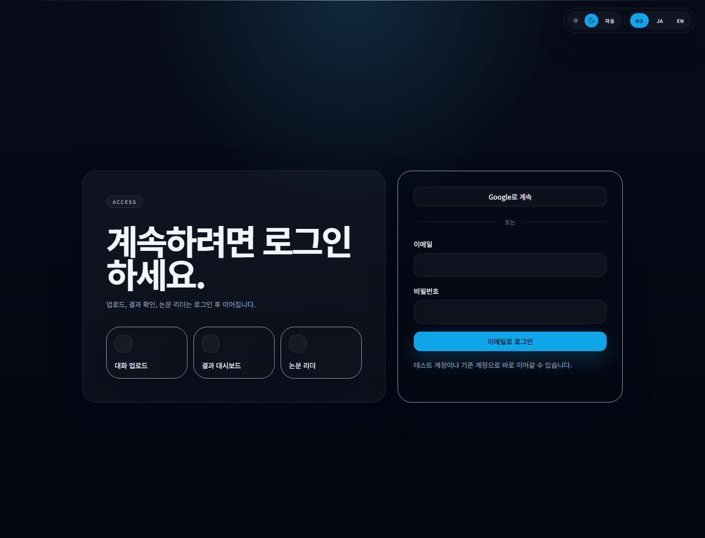

# Chat Paper

[English](README.md) | [한국어](README.ko.md) | [日本語](README.ja.md)

Korean-first AI SaaS for turning KakaoTalk logs and AI conversations into academic-style papers.


## Overview

Chat Paper helps users upload conversation data, analyze tone and structure, and turn it into a journal-style paper draft with a premium research dashboard and reader flow.

## Screenshots

### Landing


### Upload flow


### Secure sign-in



## Highlights

- Korean-first premium UI with dark mode and `KO / JA / EN` language switching
- KakaoTalk and AI conversation upload flow
- Conversation parsing and analysis pipeline
- Academic paper viewer with export actions
- Next.js App Router, Prisma, NextAuth, and OpenAI integration

## Tech Stack

- Next.js 14
- TypeScript
- Tailwind CSS
- Prisma + PostgreSQL
- NextAuth
- OpenAI API

## Quick Start

```bash
npm install
npm run db:generate
npm run db:push
npm run dev
```

Copy `.env.example` to `.env.local` before running the Prisma and dev commands.

Open [http://localhost:3000](http://localhost:3000).

## Environment Variables

Create `.env.local` from `.env.example`.

```bash
OPENAI_API_KEY=
DATABASE_URL=
NEXTAUTH_SECRET=
NEXTAUTH_URL=http://localhost:3000
GOOGLE_CLIENT_ID=
GOOGLE_CLIENT_SECRET=
```

## Main Routes

- `/` landing
- `/upload` upload and analysis entry
- `/result?paperId=...` research dashboard
- `/paper/[paperId]` academic paper reader
- `/signin` custom auth screen

## Notes

- Result and paper routes require authentication.
- Google OAuth is optional, but its client ID and secret are needed when enabled.
- PostgreSQL must be running locally before Prisma commands can succeed.
