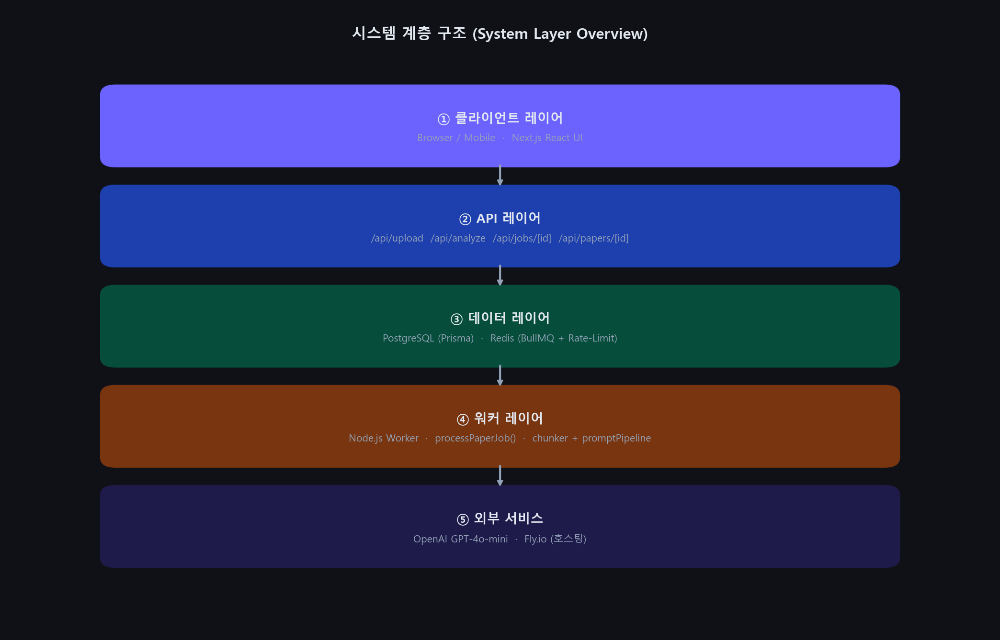
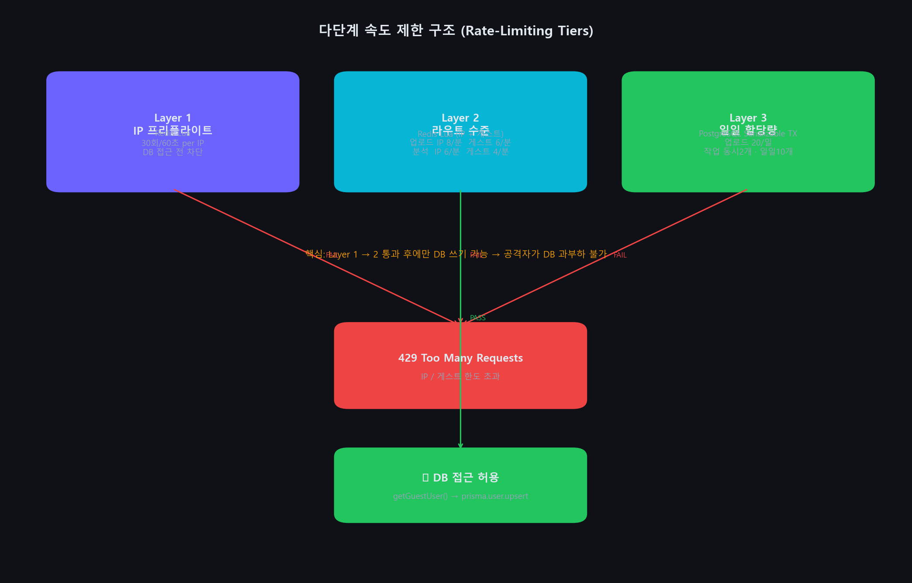
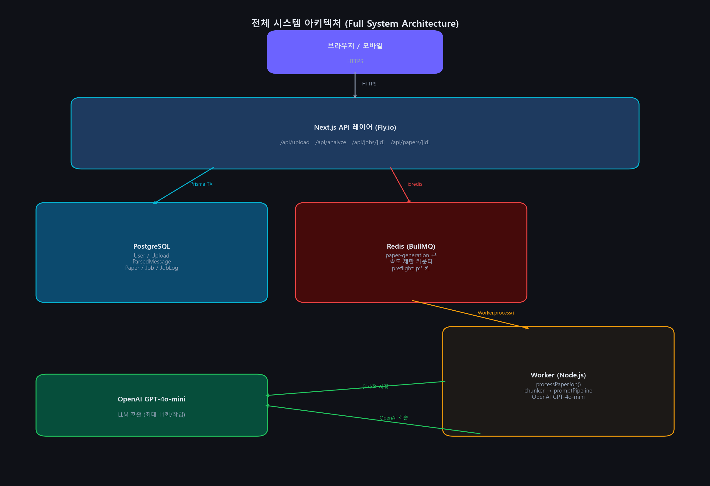
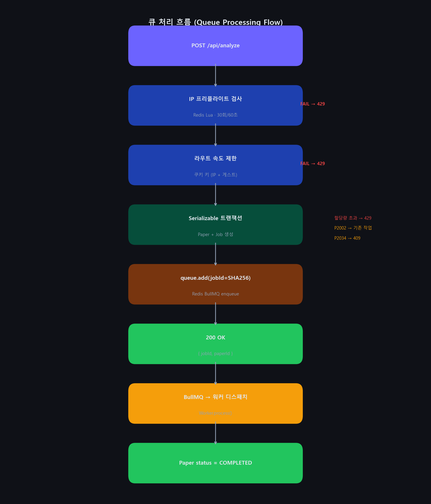
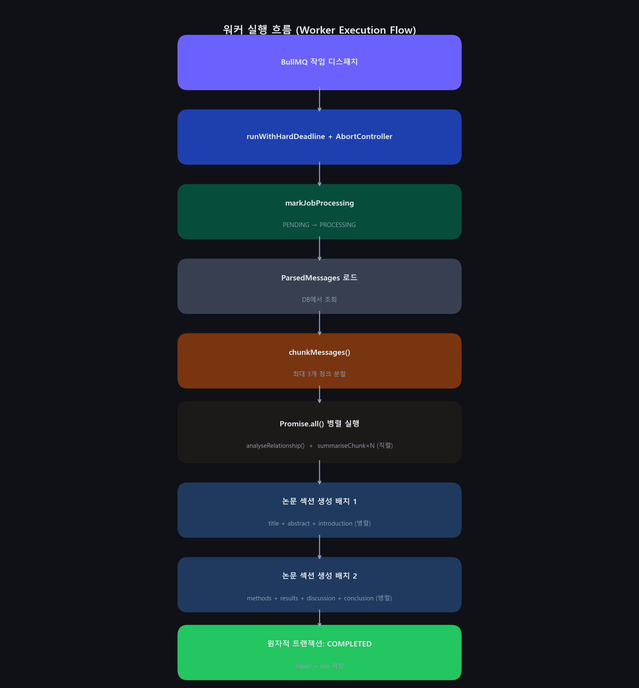
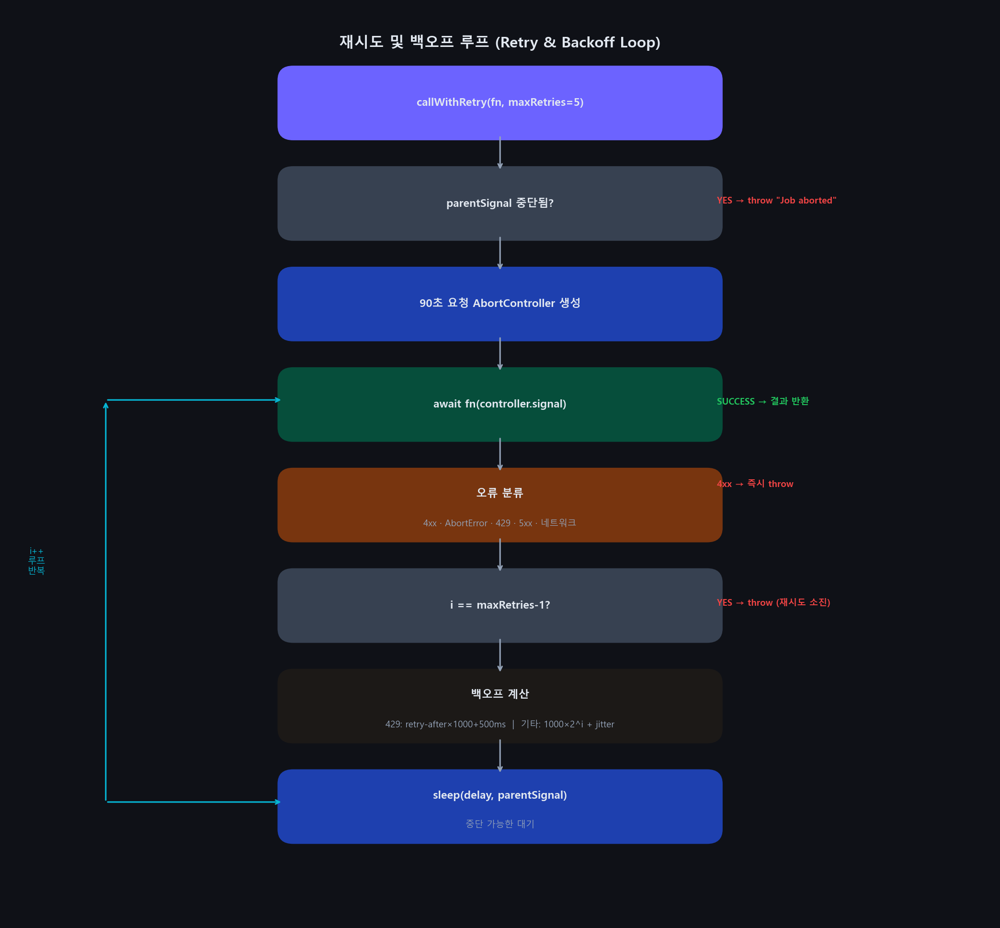
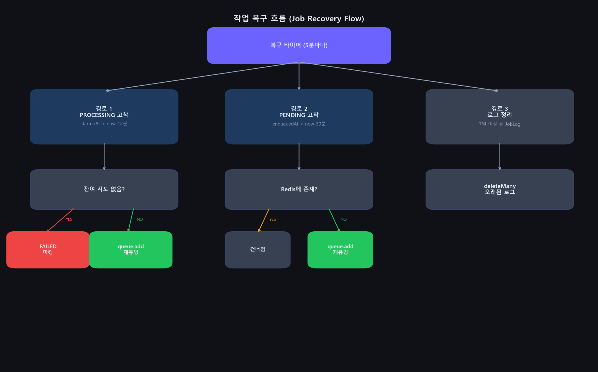

---

# Chat Paper AI 기술백서

**대화 데이터를 구조화된 학술 논문으로 변환하다**

---

**저자:** 김현조  
**프로젝트:** Chat Paper AI  
**버전:** 2.0  
**날짜:** 2025년 4월  
**저장소:** [github.com/hyeonjo00/chat-paper-platform](https://github.com/hyeonjo00/chat-paper-platform)  
**분야:** 한국어 우선 AI SaaS · 대화 분석 · 학술 논문 생성  

---

\newpage

## 목차

1. [초록](#초록)
2. [해결하려는 문제](#1-해결하려는-문제)
3. [시스템 목표](#2-시스템-목표)
4. [전체 아키텍처](#3-전체-아키텍처)
   - 3.1 계층 구조
   - 3.2 컴포넌트 책임 분리
   - 3.3 Redis 연결 이중화
5. [백엔드 상세 설계](#4-백엔드-상세-설계)
   - 4.1 업로드 API (`/api/upload`)
   - 4.2 분석 API (`/api/analyze`)
   - 4.3 작업 상태 API (`/api/jobs/[jobId]`)
6. [큐 아키텍처](#5-큐-아키텍처)
   - 5.1 BullMQ 설계
   - 5.2 멱등성 흐름
7. [워커 실행 흐름](#6-워커-실행-흐름)
   - 6.1 작업 생명주기
   - 6.2 AbortSignal 전파 체계
   - 6.3 진행률 추적
8. [데이터 모델](#7-데이터-모델)
   - 7.1 핵심 엔티티
   - 7.2 트랜잭션 일관성 보장
9. [장애 처리 및 신뢰성](#8-장애-처리-및-신뢰성)
   - 8.1 워커 하드 타임아웃
   - 8.2 고착 작업 복구
   - 8.3 그레이스풀 셧다운
10. [보안 및 비용 제어](#9-보안-및-비용-제어)
    - 9.1 다단계 속도 제한
    - 9.2 OpenAI 비용 제어
11. [OpenAI 파이프라인 아키텍처](#10-openai-파이프라인-아키텍처)
    - 10.1 프롬프트 파이프라인 계층
    - 10.2 학술 글쓰기 스타일 모디파이어
    - 10.3 섹션 생성 배치화
12. [핵심 알고리즘](#11-핵심-알고리즘)
    - 11.1 청킹 알고리즘
    - 11.2 재시도 및 지수 백오프
    - 11.3 멱등성 제어
    - 11.4 고착 작업 복구
    - 11.5 속도 제한 알고리즘
13. [배포 구조](#12-배포-구조)
    - 12.1 Fly.io 멀티 프로세스 배포
    - 12.2 TypeScript 빌드 설정
    - 12.3 환경변수
14. [성능 및 확장성](#13-성능-및-확장성)
15. [한계 및 향후 개선](#14-한계-및-향후-개선)
16. [시스템 다이어그램](#15-시스템-다이어그램)
17. [부록: 기술 스택 요약](#부록-기술-스택-요약)

---

\newpage

## 초록

Chat Paper AI는 **카카오톡, Instagram DM, LINE, AI 대화 로그**를 구조화된 학술 논문으로 자동 변환하는 한국어 우선 AI SaaS 플랫폼이다. 시스템은 Next.js API 레이어, Redis 기반 BullMQ 비동기 작업 큐, 독립 Node.js 워커 프로세스, Prisma/PostgreSQL 영속성 계층, OpenAI GPT-4o-mini 생성 파이프라인으로 구성된다.

플랫폼의 핵심 설계 목표는 세 가지다:

- **첫째:** 파일 형식과 언어에 무관하게 비정형 대화 데이터를 파싱·익명화하는 전처리 파이프라인.
- **둘째:** 장기 실행 LLM 작업(최대 10분)에서 정확히 한 번 실행(exactly-once execution)을 보장하는 멱등성 제어.
- **셋째:** 게스트 기반 사용 모델에서 DB DoS를 방지하는 다단계 속도 제한 아키텍처.

결과물은 단순한 AI 텍스트 응답이 아니라 **제목, 초록, 서론, 연구 방법, 결과, 논의, 결론**으로 구성된 논문형 문서이며, 7가지 학술 글쓰기 스타일 중 하나를 선택하여 생성된다.

---

\newpage

## 1. 해결하려는 문제

대화 데이터에는 주제 변화, 감정 흐름, 관계 역학, 발화자 역할, 커뮤니케이션 습관처럼 사람이 직접 읽어도 구조화하기 어려운 정보가 포함된다. 일반적인 채팅 백업 도구는 원문 보존에 초점을 맞추지만, 대화를 분석 가능한 연구 문서로 변환하지는 못한다.

Chat Paper AI는 비정형 대화를 학술 문서 구조로 변환한다. 결과물은 **제목, 초록, 서론, 연구 방법, 결과, 논의, 결론**으로 구성된 논문형 초안이다. 연구자, 상담사, 관계를 돌아보고 싶은 개인 모두가 대상이다.

---

\newpage

## 2. 시스템 목표

- 카카오톡, Instagram DM, LINE, AI 대화 파일을 지원하는 **한국어 우선** 업로드 경험 제공
- 회원가입 없이 사용할 수 있는 **게스트 기반 흐름** 유지
- 긴 대화 로그를 **청크 단위**로 요약한 뒤 최종 논문 생성
- 원본 파일 영구 저장을 피하고 파싱된 메시지를 **익명화**한 뒤 저장
- 결과를 **연구 대시보드**와 논문 리더 형태로 제공
- DB 접근 전에 **Redis 기반 다단계 속도 제한**으로 남용 방지
- **BullMQ 비동기 큐**로 장기 실행 작업의 신뢰성 보장

---

\newpage

## 3. 전체 아키텍처

### 3.1 계층 구조

시스템은 **다섯 개의 수직 계층**으로 구성된다.



```
┌─────────────────────────────────────────────────────┐
│                   클라이언트 (브라우저)               │
└─────────────────┬───────────────────────────────────┘
                  │ HTTPS
┌─────────────────▼───────────────────────────────────┐
│           API 레이어 (Next.js App Router)             │
│  /api/upload   /api/analyze   /api/jobs/[id]         │
│  /api/papers/[id]   /api/results/[id]                │
└──────┬────────────────────────────┬─────────────────┘
       │ prisma.$transaction        │ queue.add(jobId)
┌──────▼──────────┐    ┌───────────▼─────────────────┐
│   PostgreSQL DB  │    │     Redis (BullMQ Queue)      │
│  User / Upload   │    │  paper-generation 큐          │
│  ParsedMessage   │    │  속도 제한 카운터 키           │
│  Paper / Job     │    │  preflight:ip:* 키            │
│  JobLog / Export │    └───────────┬─────────────────┘
└──────▲───────────┘               │ Worker.process()
       │                ┌──────────▼─────────────────┐
       │                │   워커 프로세스 (Node.js)    │
       │                │  processPaperJob()           │
       │                │  chunker + promptPipeline    │
       └────────────────┤  OpenAI GPT-4o-mini 호출     │
         원자적 DB 저장  └────────────────────────────┘
```

---

### 3.2 컴포넌트 책임 분리

| 컴포넌트 | 책임 | 기술 |
|---|---|---|
| API 레이어 | 요청 검증, 속도 제한, 큐 진입점 | Next.js 14 App Router |
| Redis | 속도 제한 카운터, 작업 큐 브로커 | ioredis + BullMQ v5 |
| Worker | LLM 파이프라인 실행, 결과 영속화 | Node.js + BullMQ Worker |
| PostgreSQL | 상태 영속성, 트랜잭션 일관성 | Prisma ORM |
| OpenAI | 언어 분석, 논문 섹션 생성 | GPT-4o-mini |

---

### 3.3 Redis 연결 이중화

API와 워커는 의도적으로 **서로 다른 ioredis 연결 설정**을 사용한다.

- **API 연결** (`enableOfflineQueue: false`): Redis 장애 시 즉시 실패 반환. 사용자에게 명확한 오류 메시지를 전달하고 요청이 Redis 장애에 무한 대기하는 상황을 방지한다.
- **워커 연결** (`enableOfflineQueue: true`): 일시적 Redis 단절 후 자동 재연결. 작업 처리 연속성을 보장하고 단기 네트워크 문제로 인한 작업 손실을 방지한다.

두 연결 모두 **5회 재시도** 후 중단되는 재시도 전략(최대 **3,000ms 지연**)을 적용한다.

> **설계 결정:**  
> API와 워커의 연결을 `enableOfflineQueue`로 분리하는 것이 핵심 가용성 트레이드오프다. API는 사용자에게 즉시 오류를 보여줘야 하므로 빠른 실패가 필요하고, 워커는 단기 장애를 견뎌야 진행 중인 작업이 손실되지 않는다.

---

\newpage

## 4. 백엔드 상세 설계

### 4.1 업로드 API (`/api/upload`)

업로드 엔드포인트는 **7단계의 순차 검증 게이트**를 거친다. 핵심 불변 조건은 **두 개의 Redis 검사가 모두 통과된 이후에만 데이터베이스에 접근**한다는 것이다.

**실행 순서:**

```
1단계: checkIpPreflightRateLimit(req)
       → Redis Lua INCR, IP 해시, 30회/60초
       → Redis 오류 시 페일-클로즈 (429 반환)

2단계: req.cookies.get('chatpaper_guest')?.value ?? ''
       → 쿠키에서 게스트 키 동기적으로 읽기 (DB 접근 없음)
       → checkRouteRateLimit('upload', ip, cookieGuestKey)
       → IP 8회/분 + 게스트 6회/분

3단계: validateContentLength(req)
       → Content-Length 헤더 누락 시 거부
       → 0 이하 또는 비유한 값 거부
       → 51MB(50MB + 1MB 허용치) 초과 시 거부

4단계: getGuestUser()
       → prisma.user.upsert — 첫 번째 DB 접근
       → 게스트 사용자 레코드 없으면 생성

5단계: checkUploadQuota(userId)
       → prisma.upload.count WHERE uploadedAt >= 오늘 00:00
       → 20회/일 한도

6단계: req.formData()
       → 모든 검증 통과 후 바디 스트리밍 시작

7단계: 파일 파싱 및 DB 저장
```

> **중요:**  
> 이 순서는 DB DoS를 방지하는 핵심 설계 결정이다. 게스트 사용자 생성(DB upsert)은 두 개의 Redis 검사가 통과된 이후에만 발생하므로 공격자가 **IP당 분당 최대 30회**를 초과하여 DB 쓰기를 유발할 수 없다.

---

**ZIP 파일 보안:**

ZIP 파일 업로드는 **zip-bomb 공격에 대한 다층 방어**를 구현한다.

```
최대 항목 수:              500개
항목당 최대 비압축 크기:   50 MB
전체 비압축 총 크기:        100 MB (누적 합산)
메타데이터 검증:           _data.compressedSize + uncompressedSize
                           비음수 안전 정수 여부 확인
```

JSZip의 내부 `_data` 메타데이터를 실제 압축 해제 전에 읽어 총 메모리 사용량을 사전에 계산한다. 메타데이터가 신뢰할 수 없거나 누락된 경우 즉시 `UploadValidationError`로 거부하며, 이는 외부에서 **HTTP 422**로 반환된다 (서버 오류 500이 아님).

---

**파서 자동 감지:**

파일 형식은 **확장자와 내용 패턴 매칭**으로 자동 판별한다.

```
.html / .htm                              → Instagram DM 파서
.json + "timestamp_ms" + "sender_name"    → Instagram DM 파서 (JSON 변형)
^\d{1,2}:\d{2}\t 패턴                     → LINE 파서
*Human/*User/*Assistant 패턴              → AI 대화 파서
\d{4}년 \d{1,2}월 패턴                   → 카카오톡 파서
기본값                                    → 카카오톡 파서
```

---

### 4.2 분석 API (`/api/analyze`)

분석 API는 **큐 진입점**이자 **멱등성 제어 계층**이다.

**멱등성 키 생성:**

```
idempotencyKey = SHA-256(uploadId + ":" + writingStyle + ":" + lang)
```

> **핵심 아이디어:**  
> 동일한 업로드에 동일한 스타일과 언어로 요청하면 반드시 동일한 키가 생성된다. 이 키는 BullMQ의 `jobId`(Redis 수준 중복 방지)와 PostgreSQL의 `idempotencyKey` 유니크 제약 조건(DB 수준 중복 방지)에 **동시에** 사용되어 두 스토리지 계층 모두에서 중복 작업 생성이 불가능해진다.

**Serializable 트랜잭션 설계:**

```
BEGIN ISOLATION LEVEL SERIALIZABLE (maxWait: 5초, timeout: 30초)
  동시 실행 중 작업 수 < 2 확인
  일일 작업 수 < 10 확인
  → 한도 초과 시 QuotaExceededError throw
  INSERT INTO papers (status: PROCESSING)
  INSERT INTO jobs (idempotencyKey, status: PENDING)
COMMIT
```

Serializable 격리는 두 개의 동시 요청이 모두 할당량 검사를 통과하여 중복 레코드를 생성하는 경쟁 조건을 방지한다. 세 가지 오류 경로가 처리된다:

- `P2034` (직렬화 실패) → **409 Conflict** 반환
- `P2002` (idempotencyKey 중복) → 기존 작업 조회 후 재사용
- `QuotaExceededError` → **429** 반환 (사용자 친화적 메시지 포함)

Redis 큐 진입 실패 시, 이미 커밋된 Paper와 Job을 두 번째 트랜잭션으로 **원자적으로 `FAILED`** 상태로 전환하여 처리되지 않은 `PROCESSING` 레코드가 남지 않도록 한다.

---

### 4.3 작업 상태 API (`/api/jobs/[jobId]`)

`getJobStatus()`는 `userId` 필드를 포함하여 **소유권 검증과 상태 조회를 단일 DB 쿼리**로 수행한다. 별도의 인증 쿼리 없이 반환된 `userId`를 인증된 게스트와 비교하여 접근 제어를 처리한다.

---

\newpage

## 5. 큐 아키텍처

### 5.1 BullMQ 설계

```javascript
// 큐 옵션 (enqueuePaperJob에서 적용)
PAPER_JOB_OPTIONS = {
  attempts: 3,
  backoff: { type: 'exponential', delay: 5_000 },  // 5초 → 10초 → 20초
  removeOnComplete: { count: 100 },
  removeOnFail:     { count: 500 },
  jobId: idempotencyKey,  // BullMQ 중복 제거 키
}

// 워커 설정
Worker({
  concurrency:   env.workerConcurrency,
  lockDuration:  env.jobTimeoutMs + 90_000,  // 하드 타임아웃 위로 90초 여유
  lockRenewTime: min(2분, jobTimeoutMs / 3),
  limiter:       { max: 2, duration: 10_000 }, // 10초당 최대 2개 처리
})
```

> **설계 결정:**  
> `lockDuration`은 하드 타임아웃보다 **90초 더 길게** 설정된다. 작업 처리 중 BullMQ 잠금이 만료되면 다른 워커가 같은 작업을 가져가는 이중 실행이 발생하므로, 이를 방지하기 위한 안전 여유다.

---

### 5.2 멱등성 흐름

```
클라이언트 POST /api/analyze(uploadId, style, lang)
  ↓
SHA-256(uploadId:style:lang) = idempotencyKey
  ↓
prisma.$transaction(Serializable)
  ├─ P2002 (중복 키) → 기존 작업 반환 (멱등성)
  ├─ P2034 (직렬화 실패) → 409 (재시도 가능)
  └─ 성공 → Paper 생성, Job 생성
  ↓
queue.add('generate', payload, { jobId: idempotencyKey })
  ├─ BullMQ: 같은 jobId 존재 시 → no-op (멱등성)
  └─ 성공 → 작업 큐 진입
```

---

\newpage

## 6. 워커 실행 흐름

### 6.1 작업 생명주기

```
BullMQ가 큐에서 작업 가져옴
  ↓
runWithHardDeadline(data, jobTimeoutMs)
  AbortController 생성
  setTimeout(controller.abort, jobTimeoutMs)
  ↓
processPaperJob(data, signal)
  ↓
  markJobProcessing(jobId)   [DB: PENDING → PROCESSING]
    count != 1이면 건너뜀 (다른 워커가 이미 처리 중)
  ↓
  ParsedMessage DB에서 로드   [DB read]
  ↓
  chunkMessages()            [CPU: 토큰 추정 + 슬라이딩 윈도우]
  ↓
  Promise.all([
    analyseRelationship(signal)        [OpenAI, 최대 5회 재시도]
    sequentialChunkSummaries(signal)   [OpenAI × N, 직렬]
  ])
  ↓
  섹션 배치 1 병렬 생성   [OpenAI: title + abstract + introduction]
  ↓
  섹션 배치 2 병렬 생성   [OpenAI: methods + results + discussion + conclusion]
  ↓
  prisma.$transaction()  [DB: Paper PROCESSING→COMPLETED + Job PROCESSING→COMPLETED]
    WHERE status='PROCESSING' 조건으로 양쪽 guard
    count != 1이면 예외 발생
```

---

### 6.2 AbortSignal 전파 체계

```
작업 타임아웃 (setTimeout)
  → AbortController.abort()
    → processPaperJob: 각 단계 사이 signal.aborted 검사
    → callWithRetry: 루프 시작 시 parentSignal.aborted 검사
    → 요청별 AbortController: addEventListener로 연결
      → OpenAI SDK fetch 중단 (signal이 create()에 전달됨)
        → 네트워크 요청 즉시 취소
```

> **알고리즘 인사이트:**  
> 이 **4단계 전파 체계** 덕분에 작업 타임아웃 시 진행 중인 OpenAI HTTP 요청이 90초 타임아웃을 기다리지 않고 **수 밀리초 내에** 취소된다.

---

### 6.3 진행률 추적

각 처리 단계에서 DB의 `jobs.progress` 컬럼이 갱신된다.

```
START:               5%
MESSAGES_LOADED:    10%
RELATIONSHIP_DONE:  30%
CHUNKS_SUMMARISED:  55%
SECTIONS_BATCH1:    75%
SECTIONS_BATCH2:    95%
COMPLETED:         100%
```

---

\newpage

## 7. 데이터 모델

### 7.1 핵심 엔티티

**User:** 게스트 사용자는 `{uuid}@guest.chatpaper.local` 이메일 규칙으로 생성된다. 동일한 `upsert` 패턴이 게스트 생성을 멱등적으로 처리한다.

**Upload:** 원본 파일 메타데이터, 파싱 상태, 파생 레코드(ParsedMessage, Paper, Job)로의 링크를 저장한다. 삭제는 하위 레코드로 연쇄(Cascade) 전파된다.

**ParsedMessage:** 익명화된 개별 메시지, 발화자 가명, 타임스탬프, 선택적 토큰 수를 저장한다. `(uploadId, timestamp)` 복합 인덱스로 시간순 조회를 최적화한다.

**Paper:** 생성된 모든 섹션을 `@db.Text` 컬럼으로 저장하며, 관계 분석 필드(`relationshipType`, `relationshipIssues`, `affectionScores`)와 생성 타임스탬프를 포함한다. 상태 전이: `PROCESSING → COMPLETED | FAILED`.

**Job:** 실행 제어 레코드. 주요 필드:

| 필드 | 목적 |
|---|---|
| `idempotencyKey` | SHA-256 유니크 키, BullMQ 중복 방지 |
| `status` | PENDING → PROCESSING → COMPLETED \| FAILED |
| `progress` | 0~100 정수, 각 파이프라인 단계마다 갱신 |
| `attempts` / `maxAttempts` | 재시도 카운터와 한도 |
| `startedAt` | 복구 기준 시각 (12분 임계값) |
| `enqueuedAt` | PENDING 복구 기준 시각 (30분 임계값) |
| `errorMessage` / `errorStack` | 마지막 오류 내용 (진단 및 복구용) |

**JobLog:** 레벨, 메시지, JSON 데이터를 포함하는 추가 전용 구조화 로그. **7일 후 자동 삭제**하여 무한 증가를 방지한다.

---

### 7.2 트랜잭션 일관성 보장

다중 엔티티 상태 전이는 모두 명시적 **상태 guard**가 있는 `prisma.$transaction`을 사용한다.

```sql
-- 완료 guard (processor.ts)
UPDATE papers SET status='COMPLETED', ...
  WHERE id = ? AND status = 'PROCESSING'

UPDATE jobs SET status='COMPLETED', ...
  WHERE id = ? AND status = 'PROCESSING'

-- 두 count가 모두 1이어야 함, 아니면 예외 발생
```

> **중요:**  
> 이 패턴은 작업이 복구되어 재실행되는 동안 원래 실행이 완료 처리를 시도할 때 발생하는 **이중 완료**를 방지한다.

---

\newpage

## 8. 장애 처리 및 신뢰성

### 8.1 워커 하드 타임아웃

```
JOB_TIMEOUT_MS = env.jobTimeoutMs (환경변수로 설정)
LOCK_DURATION  = JOB_TIMEOUT_MS + 90,000ms
LOCK_RENEW     = min(2분, JOB_TIMEOUT_MS / 3)

Promise.race([
  processPaperJob(data, controller.signal),
  타임아웃 → controller.abort() → JobTimeoutError throw
])
```

타임아웃 발생 시 AbortController가 모든 진행 중인 OpenAI 요청에 신호를 전파한다.

---

### 8.2 고착 작업 복구 (5분마다 실행)

**복구 경로 1 — PROCESSING 고착 (12분 기준):**

```
1. startedAt < now - 12분인 PROCESSING 작업 조회
2. 남은 시도 횟수 확인
3. 잔여 없음 → Paper + Job 원자적 FAILED 처리
4. 잔여 있음:
   - Redis 상태 확인 (RUNNABLE 상태면 건너뜀)
   - TERMINAL 상태면 Redis 항목 제거 후 재큐
5. DB 낙관적 갱신 (updateMany WHERE status='PROCESSING')
6. count != 1이면 Redis 항목 롤백
```

**복구 경로 2 — PENDING 고착 (30분 기준):**

```
1. enqueuedAt < now - 30분인 PENDING 작업 조회
2. Redis에 같은 bullJobId가 RUNNABLE 상태면 건너뜀
3. queue.add()로 재큐 (BullMQ jobId 중복으로 이중 실행 방지)
```

**복구 경로 3 — 로그 정리 (7일 보존):**

```
prisma.jobLog.deleteMany({ where: { createdAt: { lt: now - 7일 } } })
```

---

### 8.3 그레이스풀 셧다운

```
SHUTDOWN_TIMEOUT_MS = 4,000ms  ← Fly.io SIGKILL 기본 5초보다 1초 여유

SIGTERM / SIGINT 수신
  → handleSignal() 래퍼 (거부 포착)
    → shuttingDown = true (멱등성 가드)
    → clearInterval(recoveryTimer)
    → Promise.race([worker.close(), 4초 타임아웃])
    → process.exit(0)

타임아웃 초과 시 → process.exit(1)
```

`handleSignal()` 래퍼가 `shutdown()` 프로미스 거부를 포착하여 처리되지 않은 거부로 인한 프로세스 크래시를 방지한다.

---

\newpage

## 9. 보안 및 비용 제어

### 9.1 다단계 속도 제한



```
레이어 1 — IP 프리플라이트 (Redis Lua, DB 접근 전):
  키:   preflight:ip:{SHA-256(ip)[0:32]}
  한도: 30회/60초 per IP
  실패: 페일-클로즈 (Redis 오류 시 429)

레이어 2 — 라우트 수준 (Redis Lua, IP + 게스트):
  업로드: IP 8회/분, 게스트 6회/분
  분석:   IP 6회/분, 게스트 4회/분
  게스트 키: 쿠키에서 동기적으로 읽기 (DB 접근 없음)

레이어 3 — 일일 할당량 (PostgreSQL, 사용자 생성 후):
  업로드:  사용자당 20회/일
  작업:    동시 2개, 일일 10개 (Serializable 트랜잭션)
```

> **핵심 아이디어:**  
> 이 순서가 핵심 보안 속성이다. `getGuestUser()`(`prisma.user.upsert` 실행)는 레이어 1과 2가 모두 통과된 이후에만 호출되므로, 공격자는 **Redis 한도를 초과하여 DB 쓰기를 유발할 수 없다**.

**Lua 원자성 보장:**

```lua
local n = redis.call('INCR', KEYS[1])
if n == 1 then redis.call('EXPIRE', KEYS[1], ARGV[1]) end
return n
```

> **알고리즘 인사이트:**  
> INCR과 EXPIRE를 단일 Lua 스크립트로 실행하여 두 명령 사이의 크래시로 인한 **TTL 없는 카운터 키** 버그를 방지한다. 이 버그가 발생하면 해당 IP의 정상 트래픽이 영구 차단된다.

---

### 9.2 OpenAI 비용 제어

- 청크당 최대 토큰 **9,000개** (10,000 - 1,000 시스템 프롬프트 예약)
- 최대 청크 **3개** (관계 분석 1회 + 청크 요약 최대 3회 + 섹션 7개 = 작업당 최대 **LLM 호출 11회**)
- `gpt-4o-mini` **전용** 사용 (gpt-4o 대비 약 15배 저렴)
- 할당량을 Serializable 트랜잭션 내부에서 검사하여 병렬 요청에 의한 우회 방지

---

\newpage

## 10. OpenAI 파이프라인 아키텍처

### 10.1 프롬프트 파이프라인 계층

**레이어 1: 언어 감지**
- 모델: `gpt-4o-mini`, `temperature: 0`, JSON 모드
- 입력: 최대 80개 메시지 샘플
- 출력: `{ ko: float, en: float, ja: float }` (합계 1.0 정규화)
- 명시적 언어 미지정 시 논문 언어 자동 선택에 사용

**레이어 2: 청크 요약**
- 모델: `gpt-4o-mini`, `temperature: 0.2`, JSON 모드
- 입력: 발화자 범례와 날짜 범위 컨텍스트 헤더가 포함된 청크 대화
- 출력: `{ topics, sentimentLabel, keyEvents, speakerDynamics, speakerCount, speakerProfiles, groupDynamics }`
- 그룹 인식: 1:1 vs. 다자 대화에 따라 시스템 프롬프트 자동 조정

**레이어 2.5: 관계 분석**
- 모델: `gpt-4o-mini`, `temperature: 0.3`, JSON 모드
- 입력: 첫 200개 메시지 (비용 효율을 위한 샘플링)
- 출력: `{ relationshipType, confidence, isRomantic, hasIssues, issues, affectionScores }`
- 청크 요약과 **병렬 실행**하여 전체 처리 시간 최소화

**레이어 3: 섹션 생성**
- 모델: `gpt-4o-mini`, `temperature: 0.4`
- 7가지 글쓰기 스타일별 도메인 특화 시스템 프롬프트 모디파이어
- 8개 논문 섹션을 두 개의 병렬 배치로 생성

---

### 10.2 학술 글쓰기 스타일 모디파이어

각 `WritingStyle`은 도메인 특화 지침을 시스템 프롬프트에 주입한다:

```
psychology_paper:       임상 심리학 형식 사용. 가설 검증 구조 적용.
                        관련 시 DSM 참조.

communication_analysis: 화용론과 화행 이론(Austin/Searle) 적용.
                        순서 교대 패턴 분석.

relationship_dynamics:  관계 과학과 애착 이론(Bowlby/Ainsworth) 적용.
                        친밀감과 갈등 사이클에 집중.

sociology:              질적 사회학과 근거 이론 적용.
                        사회적 맥락과 구조적 요인 강조.

behavioral_science:     행동 패턴 정량화: 빈도, 강화, 소거.
                        조작적 조건화 프레임 적용.

computational_text:     NLP 지표 포함(TF-IDF, 토픽 모델링, 감성 분류).
                        형식적 표기법 사용.

bioinformatics:         대화를 시계열 및 네트워크 상호작용으로 모델링.
                        시스템 생물학 메타포 사용.
```

---

### 10.3 섹션 생성 배치화

섹션은 **두 개의 병렬 배치**로 생성하여 OpenAI 분당 토큰 예산을 준수하면서 전체 처리 시간을 최소화한다:

```
배치 1 (병렬):  title + abstract + introduction
배치 2 (병렬):  methods + results + discussion + conclusion
```

각 섹션 호출은 `analysisContext` JSON 전체(관계 분석 + 모든 청크 요약)를 사용자 메시지로 포함하여, 모든 섹션이 **완전한 분석 결과**를 참조할 수 있도록 한다.

---

\newpage

## 11. 핵심 알고리즘

### 11.1 청킹 알고리즘

대화 메시지를 LLM 컨텍스트 윈도우에 맞게 **슬라이딩 윈도우 방식**으로 분할한다.

**파라미터:**

| 파라미터 | 값 | 설명 |
|---|---|---|
| `chunkTokens` | 10,000 | 청크당 최대 토큰 |
| `overlapTokens` | 64 | 문맥 연속성을 위한 중복 토큰 |
| `reservedForPrompt` | 1,000 | 시스템 프롬프트 여유 |
| `MAX_CHUNKS` | 3 | 비용 제어용 청크 상한 |

**한국어 토큰 추정:**

```
추정 토큰 = ceil(한국어 문자 수 × 1.5 + 비한국어 문자 수 × 0.25)
```

> **알고리즘 인사이트:**  
> 한국어는 멀티바이트 문자로 GPT 토크나이저에서 평균 **1.5 토큰**을 소비한다. 라틴 문자는 약 **0.25 토큰**이다. 이 이중 추정 방식이 한국어 중심 대화에서의 컨텍스트 오버플로우를 방지한다.

**의사코드:**

```
function chunkMessages(messages, config):
  maxPerChunk = config.chunkTokens - config.reservedForPrompt  // 9,000
  chunks = []
  start = 0

  while start < len(messages):
    tokens = estimateTokens(contextHeader)
    end = start
    while end < len(messages):
      if tokens + estimateTokens(messages[end]) > maxPerChunk AND end > start:
        break
      tokens += estimateTokens(messages[end])
      end++
    chunks.append(Chunk(messages[start:end], tokens))

    // 64 토큰 만큼 뒤로 이동하여 중복 윈도우 생성
    overlapStart = end
    accumulated = 0
    while overlapStart > start + 1:
      accumulated += estimateTokens(messages[overlapStart-1])
      if accumulated >= 64: break
      overlapStart--
    start = overlapStart

  // 3개 초과 시 가장 작은 인접 쌍 반복 병합
  while len(chunks) > 3:
    find (i, i+1) with minimum combined token count
    merge chunks[i] and chunks[i+1]

  return chunks
```

---

### 11.2 재시도 및 지수 백오프

OpenAI API 호출에 대해 **최대 5회 재시도**를 수행한다.

**재시도 대상 오류:**
- HTTP 429 (Rate Limit)
- HTTP 5xx (서버 오류)
- `ECONNRESET`, `ETIMEDOUT`, `ENOTFOUND` (네트워크 오류)
- 메시지에 `"fetch failed"`, `"network"`, `"socket"` 포함
- `AbortError` (90초 요청 타임아웃)

**백오프 계산:**

```
429인 경우:
  "try again in Xs" 메시지 파싱 → X×1000ms + 500ms
  파싱 실패 시 → 1000 × 2^i + random(0~1000)ms

그 외 재시도 가능 오류:
  delay = 1000 × 2^i + random(0~1000)ms

4xx 클라이언트 오류: 즉시 throw (재시도 없음)
```

`sleep(delay, parentSignal)` 함수는 대기 중에도 **AbortSignal을 감지**하여 즉시 깨어나 오류를 던진다.

---

### 11.3 멱등성 제어

**의사코드:**

```
function analyze(uploadId, style, lang):
  key = SHA256(uploadId + ":" + style + ":" + lang)

  try:
    (paper, job) = transaction(SERIALIZABLE):
      assertQuotaOk(userId)
      paper = INSERT papers(status=PROCESSING)
      job   = INSERT jobs(idempotencyKey=key, status=PENDING)
  catch P2002:
    existing = SELECT FROM jobs WHERE idempotencyKey=key
    return existing  // 이전에 생성된 작업 반환
  catch P2034:
    return 409 CONFLICT

  queue.add('generate', payload, { jobId: key })
  // BullMQ: 같은 jobId 존재 시 no-op
```

---

### 11.4 고착 작업 복구

**의사코드 (PROCESSING 복구):**

```
function recoverStuckJobs():
  cutoff = now - 12분
  stuck = SELECT FROM jobs WHERE status=PROCESSING AND startedAt < cutoff

  for job in stuck:
    if job.remainingAttempts <= 0:
      atomic: Job → FAILED, Paper → FAILED
      continue

    bullJobId = job.idempotencyKey ?? job.id
    existing = queue.getJob(bullJobId)

    if existing.state in RUNNABLE_STATES:
      continue  // 실행 중인 작업 — 건너뜀

    if existing.state in TERMINAL_STATES:
      existing.remove()

    added = queue.add(payload, { jobId: bullJobId })

    result = updateMany(WHERE id=job.id AND status='PROCESSING')
    if result.count != 1:
      added.remove()  // 경쟁 조건 감지 — 롤백
```

---

### 11.5 속도 제한 알고리즘

**Lua 스크립트 (원자적 INCR + 조건부 EXPIRE):**

```lua
local n = redis.call('INCR', KEYS[1])
if n == 1 then redis.call('EXPIRE', KEYS[1], ARGV[1]) end
return n
```

**의사코드:**

```
function checkIpPreflightRateLimit(req):
  try:
    ip = x-forwarded-for[0] ?? x-real-ip ?? '0.0.0.0'
    key = "preflight:ip:" + sha256(ip)[0:32]
    n = redis.eval(lua, key, windowSec=60)
    return n <= 30 ? ok : fail
  catch redisError:
    log.error(...)
    return fail  // 페일-클로즈

function checkRouteRateLimit(route, ip, cookieGuestKey):
  try:
    [ipCount, guestCount] = Promise.all([
      redis.eval(lua, "ratelimit:{route}:ip:{sha256(ip)}", 60),
      redis.eval(lua, "ratelimit:{route}:guest:{sha256(key)}", 60),
    ])
    return (ipCount <= limit.ip AND guestCount <= limit.guest) ? ok : fail
  catch:
    return fail  // 페일-클로즈
```

---

\newpage

## 12. 배포 구조

### 12.1 Fly.io 멀티 프로세스 배포

```toml
[processes]
  worker = "node dist/server/worker/index.js"

[[vm]]
  memory = "512mb"
```

워커는 Next.js 앱과 **독립된 프로세스**로 배포된다. 두 프로세스는 동일한 PostgreSQL과 Redis를 공유하지만 독립적으로 확장·재시작된다.

---

### 12.2 TypeScript 빌드 설정

```json
{
  "compilerOptions": {
    "baseUrl": "..",
    "paths": { "@/*": ["src/*"] }
  },
  "include": ["../server/**/*", "../src/lib/nlp/**/*",
              "../src/lib/openai/**/*", "../src/types/**/*"],
  "exclude": ["../src/app", "../src/components", "../src/lib/export"]
}
```

> **설계 결정:**  
> `baseUrl`과 `paths`는 `@/` 별칭을 워커 빌드에서 올바르게 해석하기 위해 필수다. `src/lib/export`는 서버 사이드 TypeScript 컴파일에 `.tsx` 파일이 포함되는 것을 막기 위해 제외한다.

---

### 12.3 환경변수

```bash
OPENAI_API_KEY=         # OpenAI API 키
DATABASE_URL=           # PostgreSQL 연결 URL
REDIS_URL=              # Redis 연결 URL
WORKER_CONCURRENCY=     # 워커 동시 처리 수
JOB_TIMEOUT_MS=         # 작업 하드 타임아웃 (밀리초)
```

---

\newpage

## 13. 성능 및 확장성

### 13.1 처리 시간 분해

| 단계 | 예상 시간 |
|---|---|
| 메시지 로드 (DB) | ~100ms |
| 청킹 | < 10ms |
| 관계 분석 (OpenAI) | 3~8초 |
| 청크 요약 × N (직렬) | 3~8초 × N |
| 섹션 배치 1 (병렬) | 5~15초 |
| 섹션 배치 2 (병렬) | 5~15초 |
| 원자적 저장 (DB) | ~200ms |
| **총계** | **약 2~8분** |

---

### 13.2 동시성 제어

- **워커 동시성:** `WORKER_CONCURRENCY` 환경변수로 조정 가능
- **BullMQ 처리율 제한:** 10초당 최대 2개 작업
- **Serializable 트랜잭션:** 동시 할당량 우회 방지
- `maxWait: 5,000ms`, `timeout: 30,000ms` (교착 방지)

---

\newpage

## 14. 한계 및 향후 개선

| 한계 | 현황 | 개선 방향 |
|---|---|---|
| 쿠키 없는 신규 방문자 공유 버킷 | 빈 게스트키 → 단일 Redis 버킷 공유 | `cookieGuestKey ?? getClientIp(req)` |
| LLM 단일 모델 의존 | gpt-4o-mini만 사용 | 모델 선택권, Anthropic 폴백 |
| 청크 최대 3개 | 매우 긴 대화의 정보 손실 가능 | 동적 청크 수 또는 2단계 요약 |
| 워커 단일 인스턴스 | 수평 확장 미지원 | BullMQ 분산 워커 클러스터 |
| 게스트 영구 보존 | 쿠키 만료 후 데이터 고아 | 비활성 게스트 주기적 정리 |
| 내보내기 캐싱 없음 | PDF/DOCX 매 요청마다 재생성 | 오브젝트 스토리지에 사전 생성·저장 |

---

\newpage

## 15. 시스템 다이어그램

### 15.1 전체 시스템 아키텍처



```
[브라우저 / 모바일]
       │ HTTPS
       ▼
┌──────────────────────────────────────────────────────┐
│              Next.js API 레이어 (Fly.io)               │
│  ┌────────────┐  ┌─────────────┐  ┌───────────────┐  │
│  │ /api/upload│  │/api/analyze │  │/api/jobs/[id] │  │
│  └──────┬─────┘  └──────┬──────┘  └───────┬───────┘  │
└─────────┼───────────────┼─────────────────┼───────────┘
          │ Prisma        │ ioredis          │ Prisma
          ▼               ▼                 ▼
┌──────────────┐   ┌─────────────────────────────┐
│ PostgreSQL   │   │       Redis (BullMQ)          │
│ User/Upload  │   │  paper-generation 큐          │
│ Paper/Job    │   │  속도 제한 카운터              │
│ JobLog       │   └────────────┬────────────────┘
└──────▲───────┘               │ Worker.process()
       │ 원자적 저장  ┌─────────▼───────────────────┐
       └─────────────┤     워커 프로세스 (Node.js)   │
                     │  processPaperJob()           │
                     │  chunker → promptPipeline    │
                     │  → OpenAI GPT-4o-mini        │
                     └─────────────────────────────┘
```

---

### 15.2 큐 처리 흐름



```
[POST /api/analyze]
       │
       ▼
[IP 프리플라이트 검사] ──FAIL──→ [429]
       │ PASS
       ▼
[라우트 속도 제한 (쿠키 키)] ──FAIL──→ [429]
       │ PASS
       ▼
[Serializable 트랜잭션]
  ├─ 할당량 초과 ──────────────→ [429 Quota Exceeded]
  ├─ P2002 ────────────────────→ [기존 작업 반환]
  ├─ P2034 ────────────────────→ [409 Conflict]
  └─ 성공 → Paper + Job 생성
       │
       ▼
[queue.add(jobId=SHA256)] ──ERROR──→ [양쪽 FAILED 처리]
       │ 성공
       ▼
[200 OK: { jobId, paperId }]
       │
       ▼
[BullMQ가 Redis에서 작업 가져옴]
       │
       ▼
[워커가 processPaperJob() 실행]
       │
       ▼
[Paper status = COMPLETED]
```

---

### 15.3 워커 실행 흐름



```
[BullMQ 작업 디스패치]
       │
       ▼
[runWithHardDeadline + AbortController]
       │
       ▼
[markJobProcessing: PENDING → PROCESSING]
       │
       ▼
[ParsedMessages 로드]
       │
       ▼
[chunkMessages() → 최대 3개 청크]
       │
       ▼
[Promise.all() 병렬 실행]
  ├── [analyseRelationship()]
  └── [summariseChunk × N (직렬)]
       │
       ▼
[분석 컨텍스트 JSON 구성]
       │
       ▼
[배치 1 병렬: title + abstract + introduction]
       │
       ▼
[배치 2 병렬: methods + results + discussion + conclusion]
       │
       ▼
[원자적 트랜잭션: Paper + Job → COMPLETED]
```

---

### 15.4 재시도 및 백오프 루프



```
[callWithRetry(fn, maxRetries=5)]
       │
       ▼
[parentSignal 중단됨?] ──YES──→ [throw 'Job aborted']
       │ NO
       ▼
[90초 요청 AbortController 생성]
       │
       ▼
[await fn(controller.signal)] ──SUCCESS──→ [결과 반환]
       │ ERROR
       ▼
[오류 분류]
  ├─ 4xx 클라이언트 오류 ──────→ [즉시 throw]
  ├─ AbortError (90초 타임아웃)
  ├─ HTTP 429 Rate Limit
  ├─ HTTP 5xx 서버 오류
  └─ 네트워크 오류 (ECONNRESET 등)
       │ 재시도 가능
       ▼
[i == maxRetries-1?] ──YES──→ [throw (소진)]
       │ NO
       ▼
[백오프 계산]
  ├─ 429: "try again in Xs" 파싱 → X×1000 + 500ms
  └─ 기타: 1000 × 2^i + jitter(0~1000)ms
       │
       ▼
[sleep(delay, parentSignal)]  ← 중단 가능한 대기
       │
       ▼
[i++, 루프 반복]
```

---

### 15.5 작업 복구 흐름



```
[복구 타이머 — 5분마다]
       │
  ┌────┴────────────────────────┬──────────────────┐
  ▼                             ▼                  ▼
[경로 1: PROCESSING 고착]   [경로 2: PENDING 고착] [경로 3: 로그 정리]
[startedAt < now-12분]      [enqueuedAt < now-30분] [7일 이상 된 로그]
  │                             │                  │
  ▼                             ▼                  ▼
[잔여 시도 없음?] YES→[FAILED]  [Redis에 존재?]    [deleteMany]
  │ NO                          YES → [건너뜀]
  ▼                             │ NO
[Redis 상태 확인]               ▼
  RUNNABLE → 건너뜀            [재큐 (BullMQ 중복 방지)]
  TERMINAL → 제거 후 재큐
  │
  ▼
[DB 낙관적 갱신]
  count != 1 → Redis 롤백
```

---

\newpage

## 부록: 기술 스택 요약

| 영역 | 기술 | 버전/설정 |
|---|---|---|
| 프레임워크 | Next.js App Router | 14+ |
| 언어 | TypeScript | strict 모드 |
| ORM | Prisma | PostgreSQL provider |
| 큐 | BullMQ | v5.75.2+ |
| Redis 클라이언트 | ioredis | 분리 연결 (API/Worker) |
| AI | OpenAI GPT-4o-mini | temperature 0~0.4 |
| 배포 | Fly.io | 512MB VM |
| 로깅 | pino | 구조화 JSON |
| 인증 | 게스트 쿠키 | 30일 만료 |

---

*Chat Paper AI 기술백서 — 버전 2.0 — 2025년 4월*
